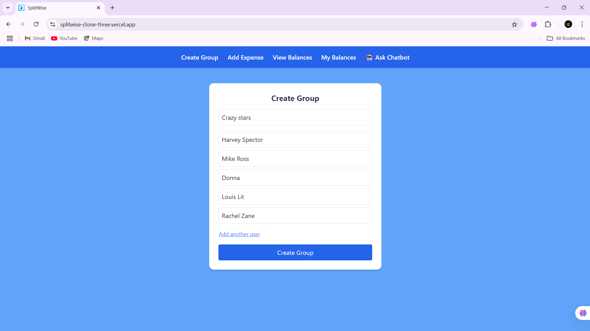
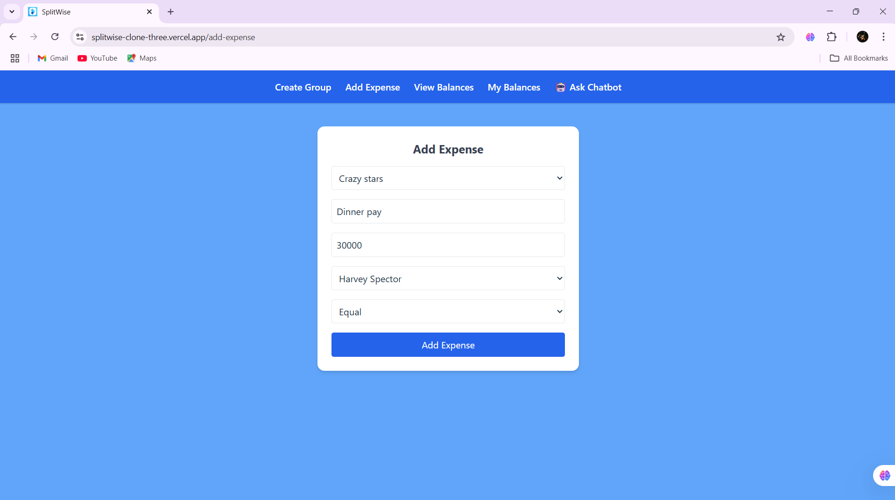
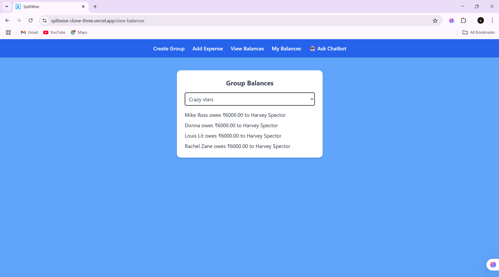
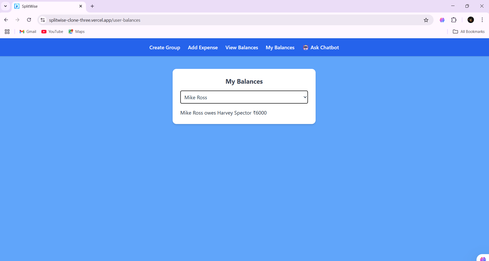

# 💸 Splitwise Clone 

A full-stack **Splitwise-inspired expense sharing app** built with **FastAPI**, **React**, **PostgreSQL**, **Docker**, and **TailwindCSS**. Users can create groups, add expenses, view balances, and even chat with an AI assistant 🤖.

---

## 🚀 Live Demo

- 🖥️ Frontend: [https://splitwise-clone-three.vercel.app](https://splitwise-clone-three.vercel.app)
- 🔧 Backend API (Swagger UI): [https://splitwise-zv50.onrender.com/docs](https://splitwise-zv50.onrender.com/docs)


---

## 📦 Tech Stack

### ⚙️ Backend
- [FastAPI](https://fastapi.tiangolo.com/) – Python web framework
- [PostgreSQL](https://www.postgresql.org/) – Relational database
- [Docker](https://www.docker.com/) + Docker Compose – Containerization
- `uvicorn` – ASGI server
- `.env` for secrets

### 🎨 Frontend
- [React](https://reactjs.org/)
- [Tailwind CSS](https://tailwindcss.com/)
- [Axios](https://axios-http.com/) – HTTP requests
- `react-router-dom` – Routing

### ☁️ Deployment
- Frontend: **Vercel**
- Backend: **Render (Dockerized)**

---

## 🧩 Features

- ✅ Create users dynamically
- ✅ Create groups with selected users
- ✅ Add expenses and automatically split them
- ✅ View group-wise balances (who owes whom)
- ✅ View personal balances (across all groups)
- ✅ 💬 Bonus: Chatbot powered by OpenAI *(temporarily disabled)*
- ✅ Fully containerized backend with Docker Compose
- ✅ Deployed and production-ready

---


### 🧾 Create Group



### Add Expenses


### 📊 View Balances


### 📊 User Balances


## 🛠️ Setup Instructions

### 🔧 Backend (FastAPI + PostgreSQL)

```bash
cd backend

# 1. Create .env file
touch .env
# Add this inside:
DATABASE_URL=postgresql://postgres:<password>@db:5432/postgres

# 2. Build and run with Docker
docker-compose up --build

🎨 Frontend (React + TailwindCSS)

cd frontend

# 1. Install dependencies
npm install

# 2. Start the dev server
npm run dev


👤 Author
Akhila K C
GitHub: @akhs77